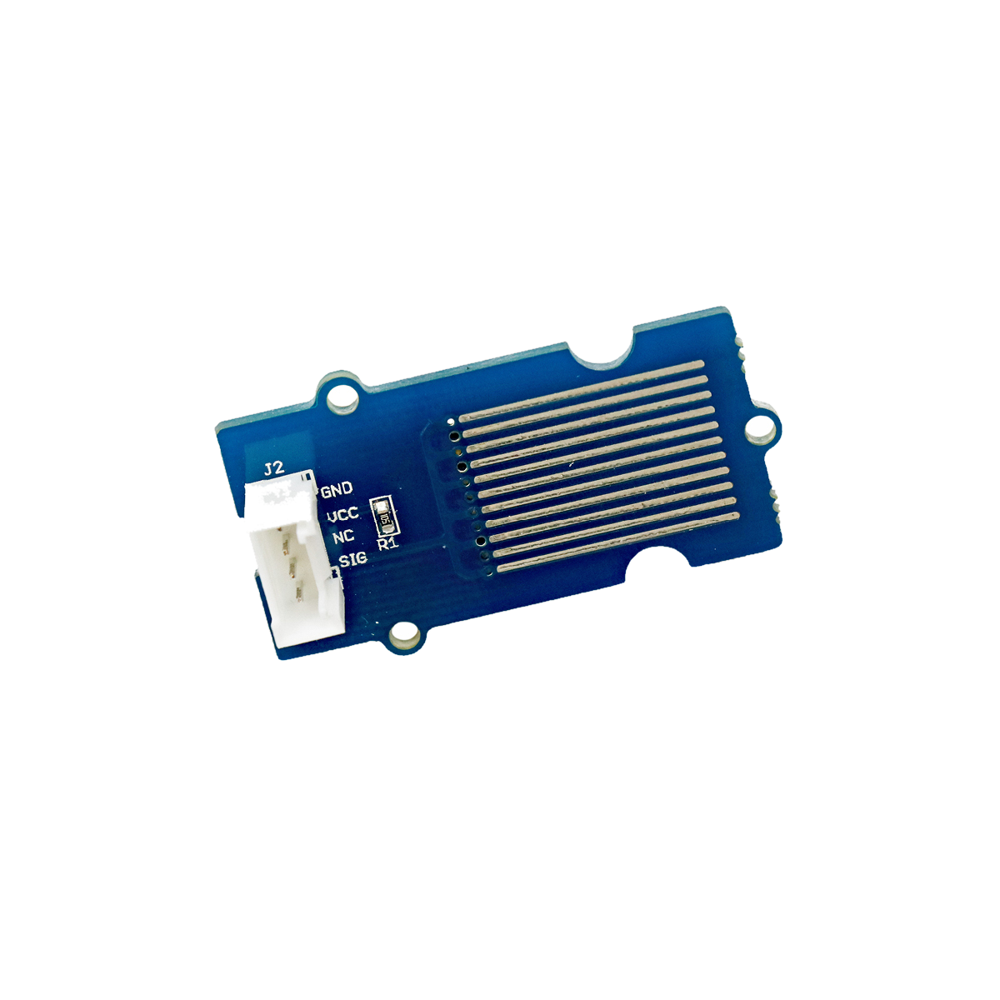

# Wasserspiegelsensor



## Beschreibung
Der Wassersensor erkennt, ob er sich in Wasser befindet. Durch mehrere integrierte Fühler, die sich abhängig vom Wasserstand im oder außerhalb des Wassers befinden, kann der Sensor den aktuellen Wasserspiegel ermitteln. Feuchtigkeit verändert seine interne Leitfähigkeit, die schließlich als Indikator für Nässe genutzt werden kann. Der Sensor kann digital als Wassererkennung oder auch analog zur Ermittlung des Wasserstands genutzt werden. Der Sensor kann direkt oder mithilfe des Grove Shields an einen Arduino (digital und analog) oder Raspberry Pi (digital) angeschlossen werden.

Ein Einsatzzweck des Wasserspiegelsensors ist kann die Erkennung von Wasserlecks sein.

Alle weiteren Hintergrundinformationen sowie ein Beispielaufbau und alle notwendigen Programmbibliotheken sind auf dem offiziellen Wiki (bisher nur in englischer Sprache) von Seeed Studio zusammengefasst. Zusätzlich findet man über alle gängigen Suchmaschinen durch die Eingabe der genauen Komponentenbezeichnung entsprechende Projektbeispiele und Tutorials.


## Beispiel

schau dir das Minimal-Beispiel an:

```c++:public/mks/parts/mks-SeeedStudio-Grove_Water_Sensor/examples/Grove_Water_Sensor_minimal/Grove_Water_Sensor_minimal.ino
// look in the linked file.
```

<!-- infolist -->

## Wichtige Links für die ersten Schritte:

- [Seeed Studio Wiki](http://wiki.seeedstudio.com/Grove-Water_Sensor/) [- Wasserspiegelsensor](http://wiki.seeedstudio.com/Grove-Water_Sensor/)

## Projektbeispiele:

- [Hackster - Vernetzte Agrikultur](https://www.hackster.io/gabogiraldo/smart-crops-implementing-iot-in-conventional-agriculture-3674a6)

## Weiterführende Hintergrundinformationen:

- [GPIO - Wikipedia Artikel](https://de.wikipedia.org/wiki/Allzweckeingabe/-ausgabe)
- [GitHub-Repository: Wasserspiegelsensor](https://github.com/MakeYourSchool/29-Wasserspiegelsensor)


